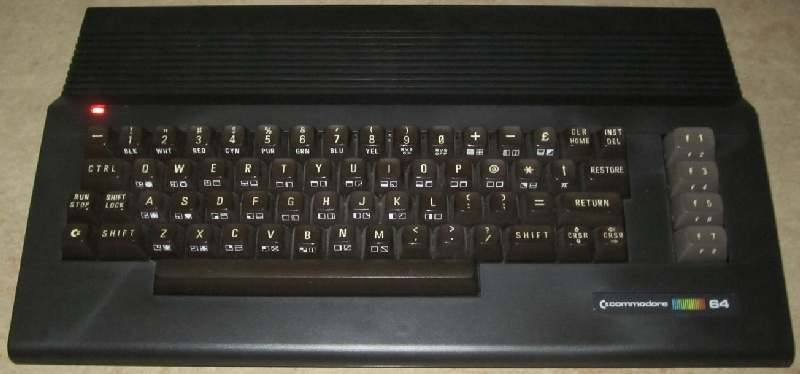
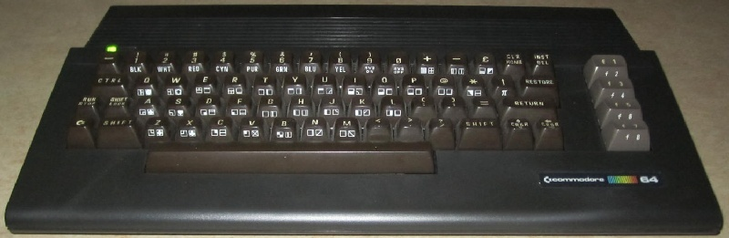
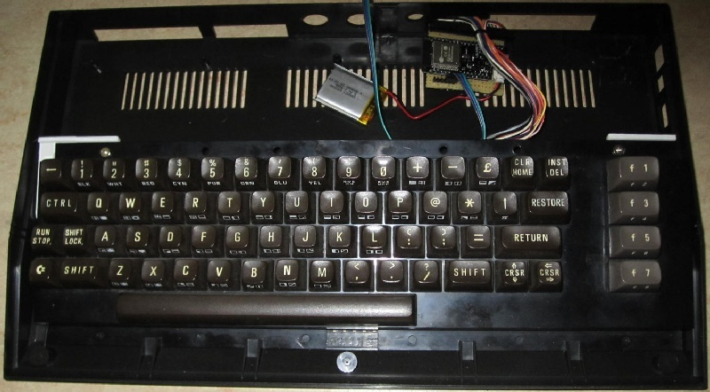
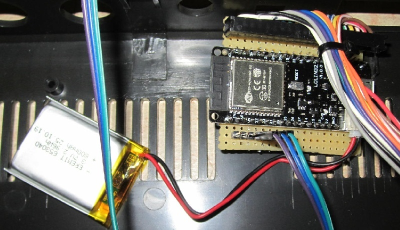

VICEboard
=========

The VICEboard enables you to connect your C64 keyboard (or one from the VIC20)
via bluetooth to a PC, Mac or Raspberry Pi. It uses the "positional" keyboard
mapping as defined by the [VICE emulator](https://vice-emu.sourceforge.io/). So
you can use this keyboard to get an experience closer to the original machine.
It is recommended to use it with the SDL version, since the VICEboard offers
optional key combinations mapping to special keys, like "CTRL + F7" will send
"F12" to access the configuration menu.

Required:
---------
- ESP32 board with at least 19 OUTPUT capable GPIOs available
- [ESP32 support in Arduino](https://github.com/espressif/arduino-esp32)
- [ESP32-BLE-Keyboard library](https://github.com/T-vK/ESP32-BLE-Keyboard)

Building:
---------
For building your own, you can wire it up as you like, just make sure that:
- For Restore use one of these GPIOs, or no waking up:
  0, 2, 4, 12, 14, 15, 25, 26, 27, 32, 33

For the rest there is a tool call GPIO_Tester that will generate a bit of
source code for you, after you've gone through all of the pins as instructed.
Replace this part at the top of VICEboard.ino, and you configuration should
work.

Pictures:
---------

Disconnected:\

Connecting turns the LED to green:\

Open:\

Controller:\

